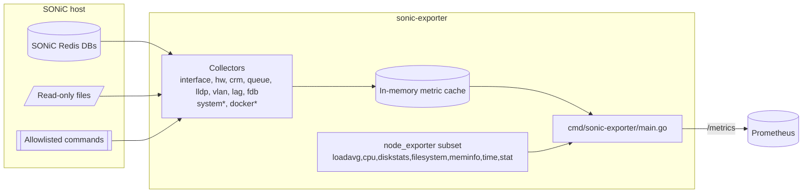

# sonic-exporter

Prometheus exporter for SONiC network switches.

This project collects switch telemetry from SONiC Redis databases and exposes it in Prometheus format. It also enables a curated subset of `node_exporter` host metrics, so you can monitor switch services and system health in one scrape target.

## Why exporters matter

Exporters let you turn platform-specific telemetry into a standard metrics format:

- Prometheus can scrape data from many systems in one consistent way.
- You can build shared dashboards and alerts across vendors and platforms.
- Metrics become queryable with one language (PromQL), which reduces operational friction.
- You can correlate switch-level signals (interfaces, queues, FDB, LLDP) with host-level signals (CPU, memory, filesystem).

For SONiC environments, this means less custom glue code and faster troubleshooting from a single monitoring stack.

## What this project is for

`sonic-exporter` is focused on production-friendly SONiC observability:

- Reads from SONiC Redis and selected local read-only sources.
- Keeps scrape latency stable with cached refresh loops per collector.
- Enforces guardrails (timeouts, caps, bounded labels) to control cardinality and scrape cost.
- Keeps experimental collectors opt-in.

## Architecture

### Runtime flow



`*` Experimental collectors are disabled by default.

### Repository structure

```text
sonic-exporter/
├── cmd/sonic-exporter/      # bootstrap, collector registration, HTTP server
├── internal/collector/      # SONiC collectors and collector tests
├── pkg/redis/               # Redis access wrapper
├── fixtures/test/           # test fixtures loaded into miniredis
├── scripts/                 # static build and package helpers
└── .github/workflows/       # CI test and release pipelines
```

For a deeper breakdown, see `docs/architecture.md`.

## Collectors

| Collector | Purpose | Default |
|---|---|---|
| Interface | Interface operation and traffic metrics | Enabled |
| HW | PSU and fan health metrics | Enabled |
| CRM | Critical resource monitoring | Enabled |
| Queue | Queue counters and watermarks | Enabled |
| LLDP | LLDP neighbors from Redis | Enabled |
| VLAN | VLAN and VLAN member state | Enabled |
| LAG | PortChannel and member state | Enabled |
| FDB | FDB summary from ASIC DB | Disabled (`FDB_ENABLED=false`) |
| System (experimental) | Switch identity, software metadata, uptime | Disabled (`SYSTEM_ENABLED=false`) |
| Docker (experimental) | Container runtime metrics from `STATE_DB` | Disabled (`DOCKER_ENABLED=false`) |

Collector implementations live in `internal/collector/*_collector.go`.

## Quick start

### Run locally

```bash
./sonic-exporter
curl localhost:9101/metrics
```

### Run dev environment

```bash
docker-compose up --build -d
curl localhost:9101/metrics
```

## Configuration

### Core settings

| Variable | Description | Default |
|---|---|---|
| `REDIS_ADDRESS` | Redis address (`host:port` for TCP) | `localhost:6379` |
| `REDIS_PASSWORD` | Password for Redis | empty |
| `REDIS_NETWORK` | Redis network type (`tcp` or `unix`) | `tcp` |

### LLDP collector

| Variable | Description | Default |
|---|---|---|
| `LLDP_ENABLED` | Enable LLDP collector | `true` |
| `LLDP_INCLUDE_MGMT` | Include management interfaces like `eth0` | `true` |
| `LLDP_REFRESH_INTERVAL` | Cache refresh interval | `30s` |
| `LLDP_TIMEOUT` | Timeout for one refresh cycle | `2s` |
| `LLDP_MAX_NEIGHBORS` | Max neighbors exported per refresh | `512` |

### VLAN collector

| Variable | Description | Default |
|---|---|---|
| `VLAN_ENABLED` | Enable VLAN collector | `true` |
| `VLAN_REFRESH_INTERVAL` | Cache refresh interval | `30s` |
| `VLAN_TIMEOUT` | Timeout for one refresh cycle | `2s` |
| `VLAN_MAX_VLANS` | Max VLANs exported per refresh | `1024` |
| `VLAN_MAX_MEMBERS` | Max VLAN members exported per refresh | `8192` |

### LAG collector

| Variable | Description | Default |
|---|---|---|
| `LAG_ENABLED` | Enable LAG collector | `true` |
| `LAG_REFRESH_INTERVAL` | Cache refresh interval | `30s` |
| `LAG_TIMEOUT` | Timeout for one refresh cycle | `2s` |
| `LAG_MAX_LAGS` | Max LAGs exported per refresh | `512` |
| `LAG_MAX_MEMBERS` | Max LAG members exported per refresh | `4096` |

### FDB collector

| Variable | Description | Default |
|---|---|---|
| `FDB_ENABLED` | Enable FDB collector | `false` |
| `FDB_REFRESH_INTERVAL` | Cache refresh interval | `60s` |
| `FDB_TIMEOUT` | Timeout for one refresh cycle | `2s` |
| `FDB_MAX_ENTRIES` | Max ASIC FDB entries processed per refresh | `50000` |
| `FDB_MAX_PORTS` | Max per-port FDB series exported | `1024` |
| `FDB_MAX_VLANS` | Max per-VLAN FDB series exported | `4096` |

### System collector (experimental)

| Variable | Description | Default |
|---|---|---|
| `SYSTEM_ENABLED` | Enable system collector | `false` |
| `SYSTEM_REFRESH_INTERVAL` | Cache refresh interval | `60s` |
| `SYSTEM_TIMEOUT` | Timeout for one refresh cycle | `4s` |
| `SYSTEM_COMMAND_ENABLED` | Enable allowlisted read-only command fallback | `true` |
| `SYSTEM_COMMAND_TIMEOUT` | Timeout per command | `2s` |
| `SYSTEM_COMMAND_MAX_OUTPUT_BYTES` | Max bytes read per command | `262144` |
| `SYSTEM_VERSION_FILE` | SONiC version metadata path | `/etc/sonic/sonic_version.yml` |
| `SYSTEM_MACHINE_CONF_FILE` | Machine config path | `/host/machine.conf` |
| `SYSTEM_HOSTNAME_FILE` | Hostname path | `/etc/hostname` |
| `SYSTEM_UPTIME_FILE` | Uptime path | `/proc/uptime` |

Enable:

```bash
SYSTEM_ENABLED=true ./sonic-exporter
```

System collector exports:

- `sonic_system_identity_info`
- `sonic_system_software_info`
- `sonic_system_uptime_seconds`
- `sonic_system_collector_success`
- `sonic_system_scrape_duration_seconds`
- `sonic_system_cache_age_seconds`

Data source order:

1. Redis (`DEVICE_METADATA|localhost`, `CHASSIS_INFO|chassis 1`)
2. Read-only files (`/etc/sonic/sonic_version.yml`, `/host/machine.conf`, `/etc/hostname`, `/proc/uptime`)
3. Optional allowlisted command fallback (`show platform summary --json`, `show version`, `show platform syseeprom`)

### Docker collector (experimental)

| Variable | Description | Default |
|---|---|---|
| `DOCKER_ENABLED` | Enable docker collector | `false` |
| `DOCKER_REFRESH_INTERVAL` | Cache refresh interval | `60s` |
| `DOCKER_TIMEOUT` | Timeout for one refresh cycle | `2s` |
| `DOCKER_MAX_CONTAINERS` | Max container entries exported per refresh | `128` |
| `DOCKER_SOURCE_STALE_THRESHOLD` | Source age threshold for stale signal | `5m` |

Enable:

```bash
DOCKER_ENABLED=true ./sonic-exporter
```

Docker collector behavior:

- Reads `STATE_DB` keys `DOCKER_STATS|*` and `DOCKER_STATS|LastUpdateTime`.
- No Docker socket access.
- No writes.
- Controlled label cardinality (`container` only).

## Metrics examples

These are compact anonymized examples. Labels can vary by SONiC platform/version.

```text
sonic_interface_operational_status{device="Ethernet0"} 1
sonic_hw_psu_operational_status{psu="PSU1"} 1
sonic_crm_stats_used{resource="ipv4_route"} 1610
sonic_queue_dropped_packets_total{device="Ethernet0",queue="3"} 73
sonic_lldp_neighbors 64
sonic_vlan_admin_status{vlan="Vlan1000"} 1
sonic_lag_oper_status{lag="PortChannel1"} 1
sonic_fdb_entries 1331
sonic_system_uptime_seconds 123456
sonic_docker_container_cpu_percent{container="swss"} 1.5
node_memory_MemAvailable_bytes 1.24e+10
```

## Validated platforms

These tests were done with SONiC Community releases (not SONiC Enterprise releases).

| Model Number | SONiC Software Version | SONiC OS Version | Distribution | Kernel | Platform | ASIC |
|---|---|---|---|---|---|---|
| DellEMC-S5232f-C8D48 | 202012 | 10 | Debian 10.13 | 4.19.0-12-2-amd64 | x86_64-dellemc_s5232f_c3538-r0 | broadcom |
| SSE-T7132SR | 202505 | 12 | Debian 12.11 | 6.1.0-29-2-amd64 | x86_64-supermicro_sse_t7132s-r0 | marvell-teralynx |
| MSN2100-CB2FC | 202411 | 12 | Debian 12.12 | 6.1.0-29-2-amd64 | x86_64-mlnx_msn2100-r0 | mellanox |

## Development

```bash
go test ./...
go build ./...
./scripts/build.sh
./scripts/package.sh
docker-compose up --build -d
```

Notes:

- `./scripts/build.sh` produces a static Linux binary (`CGO_ENABLED=0`).
- If you add keys to Redis fixtures manually, persist them with `SAVE` in Redis.

## Upstream credits and acknowledgments

This project builds on work from upstream open source projects. Thank you to the maintainers and contributors.

- SONiC project: https://github.com/sonic-net/SONiC
- Original sonic-exporter fork lineage referenced by module path `github.com/vinted/sonic-exporter`
- Prometheus ecosystem components used by this project:
  - `node_exporter`: https://github.com/prometheus/node_exporter
  - `client_golang`: https://github.com/prometheus/client_golang

If this repository was forked from another `sonic-exporter` repository in your organization history, add that URL here as well so lineage stays explicit for users.
