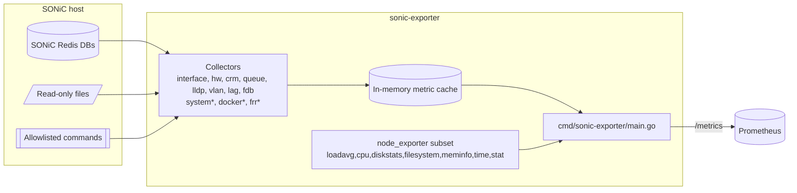

# sonic-exporter

Prometheus exporter for SONiC network switches.

This project collects switch telemetry from SONiC Redis databases and exposes it in Prometheus format. It also enables a curated subset of `node_exporter` host metrics, and can optionally expose FRRouting metrics through the upstream `frr_exporter` library, so you can monitor switch services and system health in one scrape target.

## Why exporters matter

Exporters let you turn platform-specific telemetry into a standard metrics format:

- Prometheus can scrape data from many systems in one consistent way.
- You can build shared dashboards and alerts across vendors and platforms.
- Metrics become queryable with one language (PromQL), which reduces operational friction.
- You can correlate switch-level signals (interfaces, queues, FDB, LLDP) with host-level signals (CPU, memory, filesystem).

For SONiC environments, this means less custom glue code and faster troubleshooting from a single monitoring stack.

## What this project is for

`sonic-exporter` is focused on production-friendly SONiC observability:

- Reads from SONiC Redis and selected local read-only sources.
- Keeps scrape latency stable with cached refresh loops per collector.
- Enforces guardrails (timeouts, caps, bounded labels) to control cardinality and scrape cost.
- Keeps experimental collectors opt-in.

## Architecture

### Runtime flow


```mermaid
flowchart LR
    subgraph SONiC host
        R[(SONiC Redis DBs)]
        F[/Read-only files/]
        C[[Allowlisted commands]]
    end

    subgraph sonic-exporter
        M[cmd/sonic-exporter/main.go]
        COL[Collectors\ninterface, hw, crm, queue, lldp, vlan, lag, fdb\nsystem*, docker*, frr*]
        CACHE[(In-memory metric cache)]
        NODE[node_exporter subset\nloadavg,cpu,diskstats,filesystem,meminfo,time,stat]
    end

    P[(Prometheus)]

    R --> COL
    F --> COL
    C --> COL
    COL --> CACHE
    CACHE --> M
    NODE --> M
    M -->|/metrics| P
```

`*` Experimental collectors are disabled by default.

### Repository structure

```text
sonic-exporter/
├── cmd/sonic-exporter/      # bootstrap, collector registration, HTTP server
├── internal/collector/      # SONiC collectors and collector tests
├── pkg/redis/               # Redis access wrapper
├── fixtures/test/           # test fixtures loaded into miniredis
├── scripts/                 # static build and package helpers
└── .github/workflows/       # CI test and release pipelines
```

For a deeper breakdown, see `docs/architecture.md`.

## Collectors

| Collector | Purpose | Default |
|---|---|---|
| Interface | Interface operation and traffic metrics | Enabled |
| HW | PSU and fan health metrics | Enabled |
| CRM | Critical resource monitoring | Enabled |
| Queue | Queue counters and watermarks | Enabled |
| LLDP | LLDP neighbors from Redis | Enabled |
| VLAN | VLAN and VLAN member state | Enabled |
| LAG | PortChannel and member state | Enabled |
| FDB | FDB summary from ASIC DB | Disabled (`FDB_ENABLED=false`) |
| System (experimental) | Switch identity, software metadata, uptime | Disabled (`SYSTEM_ENABLED=false`) |
| Docker (experimental) | Container runtime metrics from `STATE_DB` | Disabled (`DOCKER_ENABLED=false`) |
| FRR | FRRouting metrics via upstream `frr_exporter` | Disabled (`FRR_ENABLED=false`) |

Collector implementations live in `internal/collector/*_collector.go`.

## Quick start

### Run locally

```bash
./sonic-exporter
curl localhost:9101/metrics
```

### Run dev environment

```bash
docker-compose up --build -d
curl localhost:9101/metrics
```

`docker-compose.yaml` is for local development only. It starts a test Redis container and is not the production SONiC deployment pattern.

### Docker deployment for SONiC

Optional collectors stay opt in. Keep `SYSTEM_ENABLED=false`, `DOCKER_ENABLED=false`, and `FRR_ENABLED=false` unless you need them.

#### Build the Docker image

Use `scripts/build-image.sh` to build a local image and create an offline archive. Keep `IMAGE_TAG` immutable for each handoff so the tarball, checksum, and deployment notes all point to one exact build.

Use a real release or handoff tag. Do not use `latest`, and do not use a test-only name like `remote-smoke-*` for a deployed switch.

Good examples:

- `v0.1.0`
- `v0.1.0-f494c35`
- `2026.05.28-f494c35`

The date-plus-git-sha format is useful for offline handoffs because it is easy to trace back to the source commit.

```bash
IMAGE_NAME=sonic-exporter \
IMAGE_TAG=2026.05.28-f494c35 \
OUTPUT_DIR=./build/docker \
./scripts/build-image.sh
```

This script builds the image, writes a tarball with `docker save`, and creates a SHA256 checksum file next to it.

#### Smoke test the image

Run the local smoke test before handing the image to anyone else:

```bash
IMAGE_NAME=sonic-exporter \
IMAGE_TAG=2026.05.28-f494c35 \
./scripts/smoke-image.sh --port 19101
```

`scripts/smoke-image.sh` starts the container, checks `/metrics`, and cleans up when it is done.

#### Offline handoff

For offline environments, hand off the image tarball, the `.sha256` file, and short run instructions together. The tarball comes from `docker save`, so another team can load it with Docker on the target side and verify the checksum before use.

Example:

```bash
docker load -i build/docker/sonic-exporter-2026.05.28-f494c35-linux_amd64.docker.tar
sha256sum -c build/docker/sonic-exporter-2026.05.28-f494c35-linux_amd64.docker.tar.sha256
```

If you loaded a test image tag during a canary, retag it before using it in a persistent service:

```bash
sudo docker tag sonic-exporter:remote-smoke-20260528 sonic-exporter:2026.05.28-f494c35
sudo docker image inspect sonic-exporter:2026.05.28-f494c35 --format '{{.Id}}'
```

Only retag images you built and tested. Do not use `remote-smoke-*` tags in the final `systemd` unit.

The user's external Ansible repo should copy the tarball, load the image, and run the container later. Keep that deployment logic out of this repo.

#### Runtime environment variables

Minimum SONiC runtime settings:

```bash
REDIS_ADDRESS=127.0.0.1:6379
REDIS_NETWORK=tcp
REDIS_PASSWORD=
SONIC_DISABLED_METRICS=
FDB_ENABLED=false
SYSTEM_ENABLED=false
DOCKER_ENABLED=false
FRR_ENABLED=false
```

`127.0.0.1:6379` assumes the container uses host networking so it can reach the SONiC Redis service on the switch itself.

#### Example docker run for a manual canary

Use host networking on SONiC so Redis at `127.0.0.1:6379` stays reachable from inside the container. This direct `docker run` example is useful for a manual canary test. For reboot persistence, use the `systemd` service in the next section instead.

```bash
docker run -d \
  --name sonic-exporter \
  --network host \
  --restart unless-stopped \
  -e REDIS_ADDRESS=127.0.0.1:6379 \
  -e REDIS_NETWORK=tcp \
  -e SONIC_DISABLED_METRICS= \
  -e FDB_ENABLED=false \
  -e SYSTEM_ENABLED=false \
  -e DOCKER_ENABLED=false \
  -e FRR_ENABLED=false \
  sonic-exporter:2026.05.28-f494c35
```

#### Reboot-persistent SONiC container

SONiC starts its local containers through `systemd` services tied to `sonic.target`, such as `database.service`, `swss.service`, `pmon.service`, and `lldp.service`. For the exporter, use a dedicated `sonic-exporter.service` so `systemd` owns the container lifecycle after reboot.

This unit manages only the `sonic-exporter` container. It does not stop, remove, or restart existing SONiC containers.

Create `/etc/systemd/system/sonic-exporter.service` on the switch:

```ini
[Unit]
Description=SONiC Exporter container
Requires=docker.service database.service
After=docker.service database.service
BindsTo=sonic.target
After=sonic.target
StartLimitIntervalSec=1200
StartLimitBurst=3

[Service]
User=root
Restart=always
RestartSec=30
ExecStartPre=/bin/sh -c 'until /usr/bin/redis-cli -h 127.0.0.1 -p 6379 ping | /bin/grep -q PONG; do sleep 2; done'
ExecStartPre=-/usr/bin/docker rm -f sonic-exporter
ExecStart=/usr/bin/docker run --name sonic-exporter --label app=sonic-exporter --label managed-by=systemd --restart no --network host -e REDIS_ADDRESS=127.0.0.1:6379 -e REDIS_NETWORK=tcp -e REDIS_PASSWORD= -e SONIC_DISABLED_METRICS= -e FDB_ENABLED=false -e SYSTEM_ENABLED=false -e DOCKER_ENABLED=false -e FRR_ENABLED=false sonic-exporter:2026.05.28-f494c35
ExecStop=-/usr/bin/docker stop sonic-exporter
ExecStopPost=-/usr/bin/docker rm -f sonic-exporter

[Install]
WantedBy=sonic.target
```

Enable and start it:

```bash
sudo systemd-analyze verify /etc/systemd/system/sonic-exporter.service
sudo systemctl daemon-reload
sudo systemctl enable --now sonic-exporter.service
sudo systemctl status sonic-exporter.service --no-pager
```

Check that only the exporter container is managed by this service:

```bash
sudo docker inspect sonic-exporter \
  --format 'Name={{.Name}} Image={{.Config.Image}} Network={{.HostConfig.NetworkMode}} Restart={{.HostConfig.RestartPolicy.Name}} Status={{.State.Status}}'
```

The Docker restart policy should be `no` when `systemd` owns the container. That keeps one restart owner instead of having both Docker and `systemd` restart the same container.

Validate the Redis-backed collectors on the switch:

```bash
curl -fsS http://127.0.0.1:9101/metrics | grep -E 'sonic_.*collector_success|sonic_lldp_neighbors'
```

If you can only reach the switch through SSH, use a tunnel from your workstation:

```bash
ssh -N -L 19101:127.0.0.1:9101 192.0.2.10
```

Then scrape locally:

```bash
curl http://127.0.0.1:19101/metrics
```

Replace `192.0.2.10` with the switch management address. Direct access to `http://<switch-mgmt-ip>:9101/metrics` may not work when the management interface is in the SONiC management VRF. SSH port forwarding avoids that problem without changing switch firewall or VRF settings.

#### Upgrade the persistent container

Build and test a new immutable image tag first. Do not reuse an old tag for a different image.

Example new tag:

```bash
IMAGE_NAME=sonic-exporter \
IMAGE_TAG=2026.06.15-a1b2c3d \
OUTPUT_DIR=./build/docker \
./scripts/build-image.sh

IMAGE_NAME=sonic-exporter \
IMAGE_TAG=2026.06.15-a1b2c3d \
./scripts/smoke-image.sh --port 19101
```

Copy the new tarball and checksum to the switch, then load and verify it:

```bash
sha256sum -c sonic-exporter-2026.06.15-a1b2c3d-linux_amd64.docker.tar.sha256
sudo docker load -i sonic-exporter-2026.06.15-a1b2c3d-linux_amd64.docker.tar
sudo docker image inspect sonic-exporter:2026.06.15-a1b2c3d --format '{{.Id}}'
```

Update only the image tag in `/etc/systemd/system/sonic-exporter.service`, then restart only the exporter service:

```bash
sudo cp /etc/systemd/system/sonic-exporter.service /etc/systemd/system/sonic-exporter.service.bak
sudoedit /etc/systemd/system/sonic-exporter.service
sudo systemd-analyze verify /etc/systemd/system/sonic-exporter.service
sudo systemctl daemon-reload
sudo systemctl restart sonic-exporter.service
sudo systemctl status sonic-exporter.service --no-pager
```

Validate the new container:

```bash
sudo docker inspect sonic-exporter \
  --format 'Image={{.Config.Image}} Status={{.State.Status}} Restart={{.HostConfig.RestartPolicy.Name}}'
curl -fsS http://127.0.0.1:9101/metrics | grep -E 'sonic_.*collector_success|sonic_lldp_neighbors'
```

Keep the previous image tag on the switch until the new one has been checked. That makes rollback simple.

#### Roll back to the previous image

Confirm the old image still exists:

```bash
sudo docker image inspect sonic-exporter:2026.05.28-f494c35 --format '{{.Id}}'
```

Change `/etc/systemd/system/sonic-exporter.service` back to the previous image tag, then reload and restart only this service:

```bash
sudoedit /etc/systemd/system/sonic-exporter.service
sudo systemd-analyze verify /etc/systemd/system/sonic-exporter.service
sudo systemctl daemon-reload
sudo systemctl restart sonic-exporter.service
sudo systemctl status sonic-exporter.service --no-pager
```

Do not restart SONiC core services for an exporter rollback.

#### Stop, disable, or uninstall

Stop the exporter until the next boot:

```bash
sudo systemctl stop sonic-exporter.service
```

Disable it so it does not start at boot:

```bash
sudo systemctl disable --now sonic-exporter.service
```

Fully remove the service unit and the exporter container:

```bash
sudo systemctl disable --now sonic-exporter.service
sudo systemctl reset-failed sonic-exporter.service 2>/dev/null || true
sudo rm -f /etc/systemd/system/sonic-exporter.service
sudo systemctl daemon-reload
sudo docker rm -f sonic-exporter 2>/dev/null || true
```

Optionally remove only known exporter image tags after you are sure they are no longer needed:

```bash
sudo docker image rm sonic-exporter:2026.05.28-f494c35
sudo docker image rm sonic-exporter:2026.06.15-a1b2c3d
```

Do not use `docker system prune`, `docker container prune`, or broad `docker rm` commands on a SONiC switch. Those commands can affect SONiC containers that are unrelated to this exporter.

Do not mount /var/run/docker.sock. The Docker collector reads SONiC `STATE_DB` data only and does not need Docker socket access.

If you enable optional collectors later, add only the read-only mounts they need:

- `/etc/sonic:/etc/sonic:ro` for System collector version files
- `/host:/host:ro` for System collector machine data
- `/proc:/proc:ro` for System collector uptime
- `/var/run/frr:/var/run/frr:ro` for FRR socket access

Keep these mounts out unless the related optional collector is enabled.

#### Handoff notes

- This repo builds and tests the image locally.
- The external Ansible repo should handle copy, `docker load`, container creation, and later rollout steps.
- Registry publishing is optional and not required for the offline workflow.
- If you want Debian 11 targets later, treat them as canary validation first. They are not documented here as already validated.

## Configuration

### Core settings

| Variable | Description | Default |
|---|---|---|
| `REDIS_ADDRESS` | Redis address (`host:port` for TCP) | `localhost:6379` |
| `REDIS_PASSWORD` | Password for Redis | empty |
| `REDIS_NETWORK` | Redis network type (`tcp` or `unix`) | `tcp` |
| `SONIC_DISABLED_METRICS` | Comma-separated full metric names or wildcard patterns to suppress for in-repo SONiC collectors only | empty |

### Source-side metric disabling

Use `SONIC_DISABLED_METRICS` to suppress metric families from the in-repo SONiC collectors at exporter startup.

- Matching uses full Prometheus metric names only.
- Matching is case-sensitive.
- Tokens are comma-separated and surrounding whitespace is ignored.
- You must restart the exporter after changing this setting. There is no runtime reload.
- This applies only to the in-repo SONiC collectors in this repo. It does not apply to upstream `node_exporter` metrics or FRR wrapper metrics.

Exact-name example:

```bash
SONIC_DISABLED_METRICS=sonic_queue_watermark_bytes_total,sonic_interface_mtu_bytes
```

Wildcard example:

```bash
SONIC_DISABLED_METRICS='sonic_queue_*'
```

Be careful with broad patterns. A wide match can also hide health metrics such as `sonic_queue_collector_success`, `sonic_queue_scrape_duration_seconds`, `sonic_system_collector_success`, or `sonic_system_scrape_duration_seconds` if the full metric names match.

### LLDP collector

| Variable | Description | Default |
|---|---|---|
| `LLDP_ENABLED` | Enable LLDP collector | `true` |
| `LLDP_INCLUDE_MGMT` | Include management interfaces like `eth0` | `true` |
| `LLDP_REFRESH_INTERVAL` | Cache refresh interval | `30s` |
| `LLDP_TIMEOUT` | Timeout for one refresh cycle | `2s` |
| `LLDP_MAX_NEIGHBORS` | Max neighbors exported per refresh | `512` |

### VLAN collector

| Variable | Description | Default |
|---|---|---|
| `VLAN_ENABLED` | Enable VLAN collector | `true` |
| `VLAN_REFRESH_INTERVAL` | Cache refresh interval | `30s` |
| `VLAN_TIMEOUT` | Timeout for one refresh cycle | `2s` |
| `VLAN_MAX_VLANS` | Max VLANs exported per refresh | `1024` |
| `VLAN_MAX_MEMBERS` | Max VLAN members exported per refresh | `8192` |

### LAG collector

| Variable | Description | Default |
|---|---|---|
| `LAG_ENABLED` | Enable LAG collector | `true` |
| `LAG_REFRESH_INTERVAL` | Cache refresh interval | `30s` |
| `LAG_TIMEOUT` | Timeout for one refresh cycle | `2s` |
| `LAG_MAX_LAGS` | Max LAGs exported per refresh | `512` |
| `LAG_MAX_MEMBERS` | Max LAG members exported per refresh | `4096` |

### FDB collector

| Variable | Description | Default |
|---|---|---|
| `FDB_ENABLED` | Enable FDB collector | `false` |
| `FDB_REFRESH_INTERVAL` | Cache refresh interval | `60s` |
| `FDB_TIMEOUT` | Timeout for one refresh cycle | `2s` |
| `FDB_MAX_ENTRIES` | Max ASIC FDB entries processed per refresh | `50000` |
| `FDB_MAX_PORTS` | Max per-port FDB series exported | `1024` |
| `FDB_MAX_VLANS` | Max per-VLAN FDB series exported | `4096` |

### System collector (experimental)

| Variable | Description | Default |
|---|---|---|
| `SYSTEM_ENABLED` | Enable system collector | `false` |
| `SYSTEM_REFRESH_INTERVAL` | Cache refresh interval | `60s` |
| `SYSTEM_TIMEOUT` | Timeout for one refresh cycle | `4s` |
| `SYSTEM_COMMAND_ENABLED` | Enable allowlisted read-only command fallback | `true` |
| `SYSTEM_COMMAND_TIMEOUT` | Timeout per command | `2s` |
| `SYSTEM_COMMAND_MAX_OUTPUT_BYTES` | Max bytes read per command | `262144` |
| `SYSTEM_VERSION_FILE` | SONiC version metadata path | `/etc/sonic/sonic_version.yml` |
| `SYSTEM_MACHINE_CONF_FILE` | Machine config path | `/host/machine.conf` |
| `SYSTEM_HOSTNAME_FILE` | Hostname path | `/etc/hostname` |
| `SYSTEM_UPTIME_FILE` | Uptime path | `/proc/uptime` |

Enable:

```bash
SYSTEM_ENABLED=true ./sonic-exporter
```

System collector exports:

- `sonic_system_identity_info`
- `sonic_system_software_info`
- `sonic_system_uptime_seconds`
- `sonic_system_collector_success`
- `sonic_system_scrape_duration_seconds`
- `sonic_system_cache_age_seconds`

Data source order:

1. Redis (`DEVICE_METADATA|localhost`, `CHASSIS_INFO|chassis 1`)
2. Read-only files (`/etc/sonic/sonic_version.yml`, `/host/machine.conf`, `/etc/hostname`, `/proc/uptime`)
3. Optional allowlisted command fallback (`show platform summary --json`, `show version`, `show platform syseeprom`)

### Docker collector (experimental)

| Variable | Description | Default |
|---|---|---|
| `DOCKER_ENABLED` | Enable docker collector | `false` |
| `DOCKER_REFRESH_INTERVAL` | Cache refresh interval | `60s` |
| `DOCKER_TIMEOUT` | Timeout for one refresh cycle | `2s` |
| `DOCKER_MAX_CONTAINERS` | Max container entries exported per refresh | `128` |
| `DOCKER_SOURCE_STALE_THRESHOLD` | Source age threshold for stale signal | `5m` |

Enable:

```bash
DOCKER_ENABLED=true ./sonic-exporter
```

Docker collector behavior:

- Reads `STATE_DB` keys `DOCKER_STATS|*` and `DOCKER_STATS|LastUpdateTime`.
- No Docker socket access.
- No writes.
- Controlled label cardinality (`container` only).

### FRR collector

| Variable | Description | Default |
|---|---|---|
| `FRR_ENABLED` | Enable FRR collector wrapper | `false` |
| `FRR_SOCKET_DIR_PATH` | FRR Unix socket directory | `/var/run/frr` |
| `FRR_SOCKET_TIMEOUT` | Timeout for FRR socket access | `20s` |
| `FRR_VTYSH_ENABLED` | Use `vtysh` instead of Unix sockets | `false` |
| `FRR_VTYSH_PATH` | Path to `vtysh` | `/usr/bin/vtysh` |
| `FRR_VTYSH_TIMEOUT` | Timeout for `vtysh` commands | `20s` |
| `FRR_VTYSH_SUDO` | Run `vtysh` through `sudo` | `false` |
| `FRR_VTYSH_OPTIONS` | Extra options passed to `vtysh` | empty |
| `FRR_BGP_ENABLED` | Enable upstream `bgp` collector | `true` |
| `FRR_BGP6_ENABLED` | Enable upstream `bgp6` collector | `false` |
| `FRR_BGPL2VPN_ENABLED` | Enable upstream `bgpl2vpn` collector | `false` |
| `FRR_OSPF_ENABLED` | Enable upstream `ospf` collector | `true` |
| `FRR_OSPF_INSTANCES` | Comma-separated OSPF instance IDs | empty |
| `FRR_BFD_ENABLED` | Enable upstream `bfd` collector | `true` |
| `FRR_ROUTE_ENABLED` | Enable upstream `route` collector | `true` |
| `FRR_ROUTE_DETAILED_ENABLED` | Enable detailed route metrics | `false` |
| `FRR_RPKI_ENABLED` | Enable upstream `rpki` collector | `false` |
| `FRR_VRRP_ENABLED` | Enable upstream `vrrp` collector | `false` |
| `FRR_PIM_ENABLED` | Enable upstream `pim` collector | `false` |
| `FRR_STATUS_ENABLED` | Enable upstream `status` collector | `true` |
| `FRR_BGP_PEER_TYPES_ENABLED` | Enable peer-type aggregate metric | `false` |
| `FRR_BGP_PEER_TYPES_KEYS` | Comma-separated BGP peer-type keys | `type` |
| `FRR_BGP_PEER_DESCRIPTIONS_ENABLED` | Add structured peer descriptions as labels | `false` |
| `FRR_BGP_PEER_DESCRIPTIONS_PLAIN_TEXT` | Use plain-text peer descriptions | `false` |
| `FRR_BGP_PEER_GROUPS_ENABLED` | Add peer group labels | `false` |
| `FRR_BGP_PEER_HOSTNAMES_ENABLED` | Add peer hostname labels | `false` |
| `FRR_BGP_ADVERTISED_PREFIXES_ENABLED` | Query advertised prefix counts for older FRR | `false` |
| `FRR_BGP_ACCEPTED_FILTERED_PREFIXES_ENABLED` | Export accepted and filtered BGP prefix counts | `false` |
| `FRR_BGP_NEXT_HOP_INTERFACE_ENABLED` | Add next-hop interface label | `false` |
| `FRR_BGP_MONITORED_PREFIXES_FILE` | Prefix file for per-peer presence monitoring | empty |

Enable:

```bash
FRR_ENABLED=true ./sonic-exporter
```

FRR collector behavior:

- Delegates to the upstream `github.com/tynany/frr_exporter` collectors and keeps upstream metric names under the `frr_` namespace.
- Uses current upstream defaults when enabled: `bgp`, `ospf`, `bfd`, `route`, and `status` are on by default; `bgp6`, `bgpl2vpn`, `rpki`, `vrrp`, and `pim` stay opt-in.
- Uses Unix sockets by default and supports `vtysh`, but upstream also recommends leaving `vtysh` disabled unless you need it.
- `RPKI` requires FRR built with `--enable-rpki` upstream.

## Metrics examples

These are compact anonymized examples. Labels can vary by SONiC platform/version.

```text
sonic_interface_operational_status{device="Ethernet0"} 1
sonic_hw_psu_operational_status{psu="PSU1"} 1
sonic_crm_stats_used{resource="ipv4_route"} 1610
sonic_queue_dropped_packets_total{device="Ethernet0",queue="3"} 73
sonic_lldp_neighbors 64
sonic_vlan_admin_status{vlan="Vlan1000"} 1
sonic_lag_oper_status{lag="PortChannel1"} 1
sonic_fdb_entries 1331
sonic_system_uptime_seconds 123456
sonic_docker_container_cpu_percent{container="swss"} 1.5
frr_collector_up{collector="bgp"} 1
node_memory_MemAvailable_bytes 1.24e+10
```

## Validated platforms

These tests were done with SONiC Community releases (not SONiC Enterprise releases).

| Model Number | SONiC Software Version | SONiC OS Version | Distribution | Kernel | Platform | ASIC |
|---|---|---|---|---|---|---|
| DellEMC-S5232f-C8D48 | 202012 | 10 | Debian 10.13 | 4.19.0-12-2-amd64 | x86_64-dellemc_s5232f_c3538-r0 | broadcom |
| SSE-T7132SR | 202505 | 12 | Debian 12.11 | 6.1.0-29-2-amd64 | x86_64-supermicro_sse_t7132s-r0 | marvell-teralynx |
| MSN2100-CB2FC | 202411 | 12 | Debian 12.12 | 6.1.0-29-2-amd64 | x86_64-mlnx_msn2100-r0 | mellanox |

## Development

Requirements:

- Go 1.25 or newer

```bash
go test ./...
go build ./...
./scripts/build.sh
./scripts/package.sh
docker-compose up --build -d
```

Notes:

- `./scripts/build.sh` produces a static Linux binary (`CGO_ENABLED=0`).
- If you add keys to Redis fixtures manually, persist them with `SAVE` in Redis.

## Run the binary with systemd

This section shows an example way to run the `sonic-exporter` binary as a Linux service using `systemd`, with collector toggles set by environment variables. For the Docker image on a SONiC switch, prefer the `sonic-exporter.service` container unit in the Docker deployment section above.

Note: this `systemd` setup is not fully tested yet. Validate it in a lab or canary environment before using it in production.

### 1) Create a dedicated service user

```bash
sudo useradd --system --no-create-home --shell /usr/sbin/nologin sonic-exporter
```

If your distro uses `/sbin/nologin`, use that path instead.

### 2) Install the binary

```bash
sudo install -m 0755 ./sonic-exporter /usr/local/bin/sonic-exporter
```

### 3) Create an environment file

Use an env file so collector toggles and Redis settings are easy to manage without editing the unit file.

```bash
sudo install -d -m 0755 /etc/sonic-exporter
sudo tee /etc/sonic-exporter/sonic-exporter.env >/dev/null <<'EOF'
REDIS_ADDRESS=localhost:6379
REDIS_PASSWORD=
REDIS_NETWORK=tcp
SONIC_DISABLED_METRICS=

LLDP_ENABLED=true
VLAN_ENABLED=true
LAG_ENABLED=true
FDB_ENABLED=false
SYSTEM_ENABLED=false
DOCKER_ENABLED=false
FRR_ENABLED=false
EOF
```

### 4) Create the systemd unit

Create `/etc/systemd/system/sonic-exporter.service`:

```ini
[Unit]
Description=SONiC Prometheus Exporter
Documentation=https://github.com/rokernel/sonic-exporter
Wants=network-online.target
After=network-online.target

[Service]
Type=simple
User=sonic-exporter
Group=sonic-exporter

EnvironmentFile=/etc/sonic-exporter/sonic-exporter.env
ExecStart=/usr/local/bin/sonic-exporter
Restart=on-failure
RestartSec=5s

# Logging
StandardOutput=journal
StandardError=journal

# Hardening (safe defaults for this exporter)
NoNewPrivileges=true
PrivateTmp=true
ProtectSystem=strict
ProtectHome=true
ProtectKernelTunables=true
ProtectKernelModules=true
ProtectControlGroups=true
LockPersonality=true
MemoryDenyWriteExecute=true
RestrictSUIDSGID=true
RestrictRealtime=true
SystemCallArchitectures=native

# Allow read access to host and SONiC files used by collectors
ReadOnlyPaths=/etc/sonic /host /proc

[Install]
WantedBy=multi-user.target
```

### 5) Enable and start

```bash
sudo systemctl daemon-reload
sudo systemctl enable --now sonic-exporter
sudo systemctl status sonic-exporter
```

### 6) Validate service and metrics

```bash
sudo systemctl show sonic-exporter --property=Environment
curl -s http://127.0.0.1:9101/metrics | head
```

To confirm a specific collector is enabled/disabled, look for its metric prefix:
- LLDP: `sonic_lldp_`
- VLAN: `sonic_vlan_`
- LAG: `sonic_lag_`
- FDB: `sonic_fdb_`
- System: `sonic_system_`
- Docker: `sonic_docker_`
- FRR: `frr_`

### 7) Change collector settings safely

Edit env file only, then restart:

```bash
sudoedit /etc/sonic-exporter/sonic-exporter.env
sudo systemctl restart sonic-exporter
```

### 8) Prefer overrides for local customization

If the unit is package-managed in future, do not edit it directly. Use an override:

```bash
sudo systemctl edit sonic-exporter
```

Example override:

```ini
[Service]
Environment="FDB_ENABLED=true"
Environment="SYSTEM_ENABLED=true"
```

Then:

```bash
sudo systemctl daemon-reload
sudo systemctl restart sonic-exporter
```

### Testing safely without breaking production

Validate unit syntax first (no restart):

```bash
sudo systemd-analyze verify /etc/systemd/system/sonic-exporter.service
```

Run a **canary** service on a different port:

1. Copy unit to `sonic-exporter-canary.service`
2. Change `ExecStart=/usr/local/bin/sonic-exporter --web.listen-address=:19101`
3. Optionally use a canary env file
4. Start only canary:
   ```bash
   sudo systemctl daemon-reload
   sudo systemctl start sonic-exporter-canary
   sudo systemctl status sonic-exporter-canary
   ```
- Verify:
   - `curl -sf http://127.0.0.1:19101/metrics >/dev/null && echo OK`
   - `journalctl -u sonic-exporter-canary -n 100 --no-pager`
- Clean rollback:
   ```bash
   sudo systemctl stop sonic-exporter-canary
   sudo systemctl disable sonic-exporter-canary
   rm /etc/systemd/system/sonic-exporter-canary.service
   ```

### Notes

- SONiC collector toggles are controlled by environment variables, not dedicated CLI flags.
- Keep `SYSTEM_ENABLED` and `DOCKER_ENABLED` off unless you need them.
- If hardening blocks file access on your distro, relax only the minimum setting and document the reason.

## Disclaimer

This project is primarily a learning exercise, and parts of it were developed using AI-assisted workflows (often referred to as "vibe coding") while learning Go.

Before any production deployment, the source code must be reviewed, validated, and approved by qualified human engineers.

## Upstream credits and acknowledgments

This project builds on work from upstream open source projects. Thank you to the maintainers and contributors.

- SONiC project: https://github.com/sonic-net/SONiC
- Original sonic-exporter fork lineage referenced by module path `github.com/vinted/sonic-exporter`
- Prometheus ecosystem components used by this project:
  - `node_exporter`: https://github.com/prometheus/node_exporter
  - `client_golang`: https://github.com/prometheus/client_golang

If this repository was forked from another `sonic-exporter` repository in your organization history, add that URL here as well so lineage stays explicit for users.
