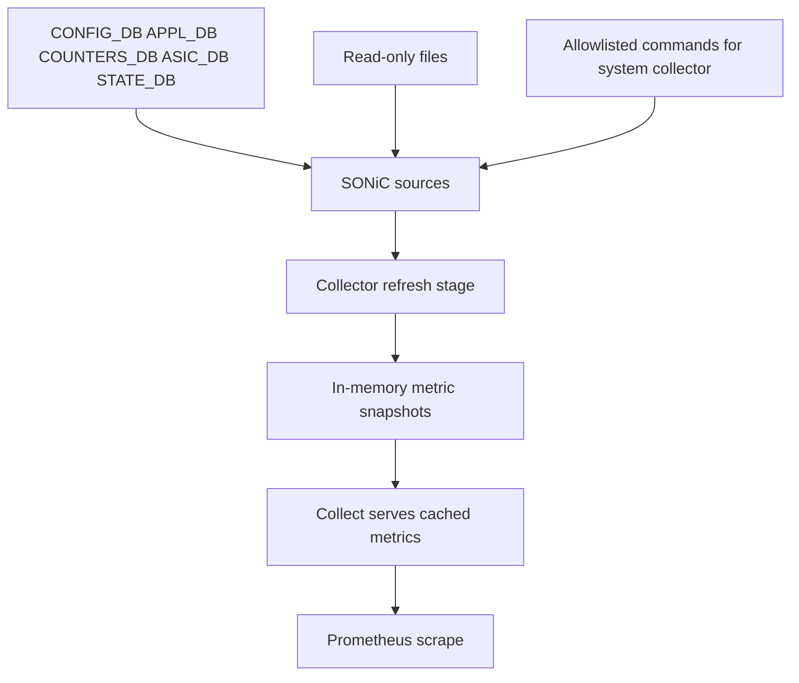

# Architecture

This document explains how `sonic-exporter` is built, how caching works, how to add collectors safely, and which patterns to follow.

## Design goals

- Keep collection read-only and safe for production SONiC switches.
- Keep scrape latency predictable with cached snapshots.
- Keep label cardinality bounded.
- Make collectors easy to extend without changing exporter core behavior.

## High-level design



## Runtime wiring

- Entrypoint: `cmd/sonic-exporter/main.go`.
- Core collectors are always registered:
  - `NewInterfaceCollector`, `NewHwCollector`, `NewCrmCollector`, `NewQueueCollector`.
- Optional collectors are gated by `IsEnabled()` before registration:
  - `NewLldpCollector`, `NewVlanCollector`, `NewLagCollector`, `NewFdbCollector`, `NewSystemCollector`, `NewDockerCollector`.
- The binary also registers a curated `node_exporter` subset (`loadavg`, `cpu`, `diskstats`, `filesystem`, `meminfo`, `time`, `stat`).

## Collector execution models

This repo currently uses two cache patterns.

| Model | Collectors | Refresh trigger | Cache lock style |
|---|---|---|---|
| Scrape-time cache | `interface`, `hw`, `crm`, `queue` | Refresh inside `Collect` when older than 15s | `sync.Mutex` |
| Background refresh loop | `lldp`, `vlan`, `lag`, `fdb`, `system`, `docker` | `refreshLoop` ticker + `refreshMetrics` | `sync.RWMutex` |

### Model A: scrape-time cache (15s window)

Files: `internal/collector/interface_collector.go`, `internal/collector/hw_collector.go`, `internal/collector/crm_collector.go`, `internal/collector/queue_collector.go`.

Flow:

1. `Collect` checks `time.Since(lastScrapeTime) < 15s`.
2. If fresh, emit `cachedMetrics` only.
3. If stale, run `scrapeMetrics`, rebuild cache, append health metrics, emit.

## Model B: background refresh loop

Files: `internal/collector/lldp_collector.go`, `internal/collector/vlan_collector.go`, `internal/collector/lag_collector.go`, `internal/collector/fdb_collector.go`, `internal/collector/system_collector.go`, `internal/collector/docker_collector.go`.

Flow:

1. Constructor loads config and early-returns if disabled.
2. Constructor performs initial `refreshMetrics()`.
3. Goroutine runs `refreshLoop()` on a ticker.
4. `Collect` only reads snapshot state and emits metrics.

This model also reports cache freshness (`cache_age_seconds`) every scrape.

## Caching and concurrency details

- Scrape-time collectors use `sync.Mutex` and cache arrays built per scrape.
- Background collectors use `sync.RWMutex` and copy `cachedMetrics` under read lock before emission.
- Refresh operations use context timeouts from collector config (`<NAME>_TIMEOUT`).
- On refresh failure, collectors set `collector_success` to `0` and keep previous cache instead of clearing output.

## Source and safety model

- Redis access is centralized in `pkg/redis/client.go`.
  - Main reads use `HgetAllFromDb`, `KeysFromDb`, `ScanKeysFromDb`.
  - DB mapping is explicit via `RedisDbId` (`APPL_DB`, `COUNTERS_DB`, `ASIC_DB`, `CONFIG_DB`, `STATE_DB`).
- System collector (`internal/collector/system_collector.go`):
  - Source order: Redis -> read-only files -> optional allowlisted commands.
  - Commands are strictly allowlisted (`show platform summary --json`, `show version`, `show platform syseeprom`).
  - Command timeout and output-byte limit are enforced.
- Docker collector (`internal/collector/docker_collector.go`):
  - Reads `STATE_DB` `DOCKER_STATS|*` and `DOCKER_STATS|LastUpdateTime`.
  - Tracks source age and stale state (`source_age_seconds`, `source_stale`).

## Cardinality and scale protections

Scale-sensitive collectors expose explicit guardrails:

- LLDP: `LLDP_MAX_NEIGHBORS`, `entries_skipped`.
- VLAN: `VLAN_MAX_VLANS`, `VLAN_MAX_MEMBERS`, `entries_skipped`.
- LAG: `LAG_MAX_LAGS`, `LAG_MAX_MEMBERS`, `entries_skipped`.
- FDB: `FDB_MAX_ENTRIES`, `FDB_MAX_PORTS`, `FDB_MAX_VLANS`, `entries_skipped`, `entries_truncated`.
- Docker: `DOCKER_MAX_CONTAINERS`, `entries_skipped`, `source_stale`.

Deterministic output is preserved by sorting scanned keys before metric emission (for example in LLDP, VLAN, LAG, FDB, Docker).

## How to add a new collector

Use this workflow to match existing project style.

1. Create `internal/collector/<name>_collector.go`.
2. Define metric descriptors in `New<Name>Collector`.
3. Add config loader (`load<Name>CollectorConfig`) using shared env parsers:
   - `parseBoolEnv`, `parseDurationEnv`, `parseIntEnv`.
4. Choose execution model:
   - Scrape-time cache (simple, lower complexity).
   - Background refresh loop (better for heavier scans and bounded scrape latency).
5. Ensure `Collect` emits cached data only (no direct Redis calls in `Collect`).
6. Add health metrics:
   - `<subsystem>_collector_success`
   - `<subsystem>_scrape_duration_seconds`
   - `<subsystem>_cache_age_seconds` (for refresh-loop model)
7. Add skip/truncation/stale metrics when data volume can explode.
8. Wire collector in `cmd/sonic-exporter/main.go`:
   - instantiate `collector.New<Name>Collector(logger)`
   - register with `prometheus.MustRegister(...)`
   - if optional, gate on `IsEnabled()`.
9. Add fixture data under `fixtures/test/*.json` as needed.
10. Extend `internal/collector/collector_test.go`:
    - `CollectAndLint` check
    - success metric assertion
    - key metric assertions
    - safety metric assertions (`entries_skipped`, `entries_truncated`, etc.)
11. Update docs:
    - `README.md` collector list + env vars + examples
    - this file (`docs/architecture.md`) if architecture behavior changed.

## Best practices in this repo

- Keep collectors read-only.
- Keep labels bounded and deterministic.
- Sort key lists before mapping them into metric series.
- Use context deadlines around all refresh paths.
- Prefer partial success with skip counters over hard scrape failures when possible.
- Keep `cmd/sonic-exporter/main.go` thin (wiring only, no collector logic).

## Common anti-patterns to avoid

- Direct Redis reads in `Collect` for refresh-loop collectors.
- Emitting free-form/high-cardinality labels (raw IDs, unlimited labels).
- Missing max-cap guards on unbounded datasets.
- Adding shell command execution outside explicit allowlisted design.
- Adding test-only behavior in collector runtime code.

## Project layout

```text
sonic-exporter/
├── cmd/sonic-exporter/      # process bootstrap and collector registration
├── internal/collector/      # collector implementations + tests
├── pkg/redis/               # Redis client wrapper used by collectors
├── fixtures/test/           # miniredis fixtures for tests
├── scripts/                 # static build and package scripts
└── .github/workflows/       # CI workflows
```

## Build and test

```bash
go test ./...
go build ./...
./scripts/build.sh
./scripts/package.sh
docker-compose up --build -d
```
